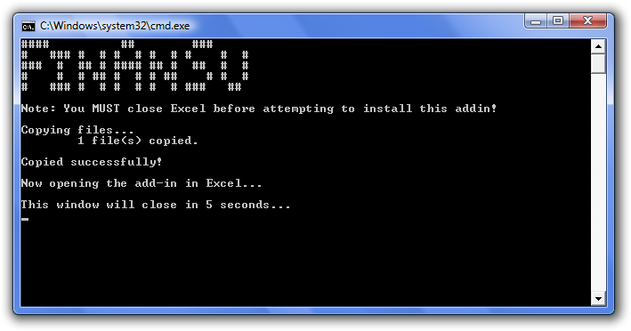
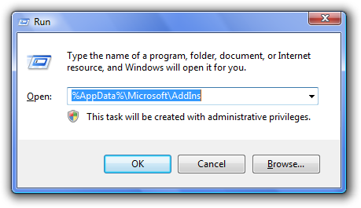

<a name="requirements">System Requirements</a>
==============================================

  * [Microsoft Excel for Windows](http://office.microsoft.com/excel/)  
    Excel 2003+ is required for live quote importing to work, and Excel 2007+ is
    required for a Ribbon interface.
  * [Microsoft .NET Framework 4](http://www.microsoft.com/downloads/details.aspx?FamilyID=9cfb2d51-5ff4-4491-b0e5-b386f32c0992)
  * The ability to install add-ins. There shouldn't be any problems unless macro
    security is set to high or you have a _very_ restrictive policy regarding
    writing to your `%AppData%` folder.

Typical Installation
====================

The follow instructions are for general users. If you're comfortable or even prone
to compiling from source, see [the section on compiling from source](#compiling).

Grab the Latest Release
-----------------------

Download the [latest zip file from the Downloads section of this
repository](https://github.com/brymck/finansu/downloads). Unzip the files to a
safe location.

Save to Add-in Directory
------------------------

Choose one of the following methods:

**Automatic:** Run `install.bat` (closing Excel if prompted).

**Manual:** Copy `FinAnSu.xll` to `%AppData%\Microsoft\AddIns`. _(Note: You
can type that into the `Start Menu > Run...` window or the location bar of any
Folder Explorer window.)_

Register in Excel
-----------------

If you've installed FinAnSu before and have it loaded as an add-in, this step is
unnecessary.

**Excel 2007+:** Click `Office Button > Excel Options... > Add-Ins`. In the
`Manage:` drop-down at the bottom, click `Excel Add-ins` and `Go...` . Place a
checkmark next to FinAnSu.

**Excel 2003-:** Go to `Tools > Add-Ins`. Place a checkmark next to FinAnSu.

If FinAnSu doesn't appear, click `Browse...` and find the add-in in your file
system. It's most likely in the first directory in the popup.

If you want to check the installation, open the `Examples.xls` spreadsheet. If
the functions are returning values, you're all set!

<a name="compiling">Compiling from Source</a>
=============================================

Note that this will require [.NET 4](http://www.microsoft.com/net) and
[Ruby](http://www.ruby-lang.org/en/downloads/):


git clone git://github.com/brymck/finansu.git
cd finansu
bundle update
git submodule init
git submodule update
rake build


Note that this will copy two files, `FinAnSu_x86.xll` and `FinAnSu_x64.xll` to
your `%AppData%\Microsoft\AddIns` directory.
